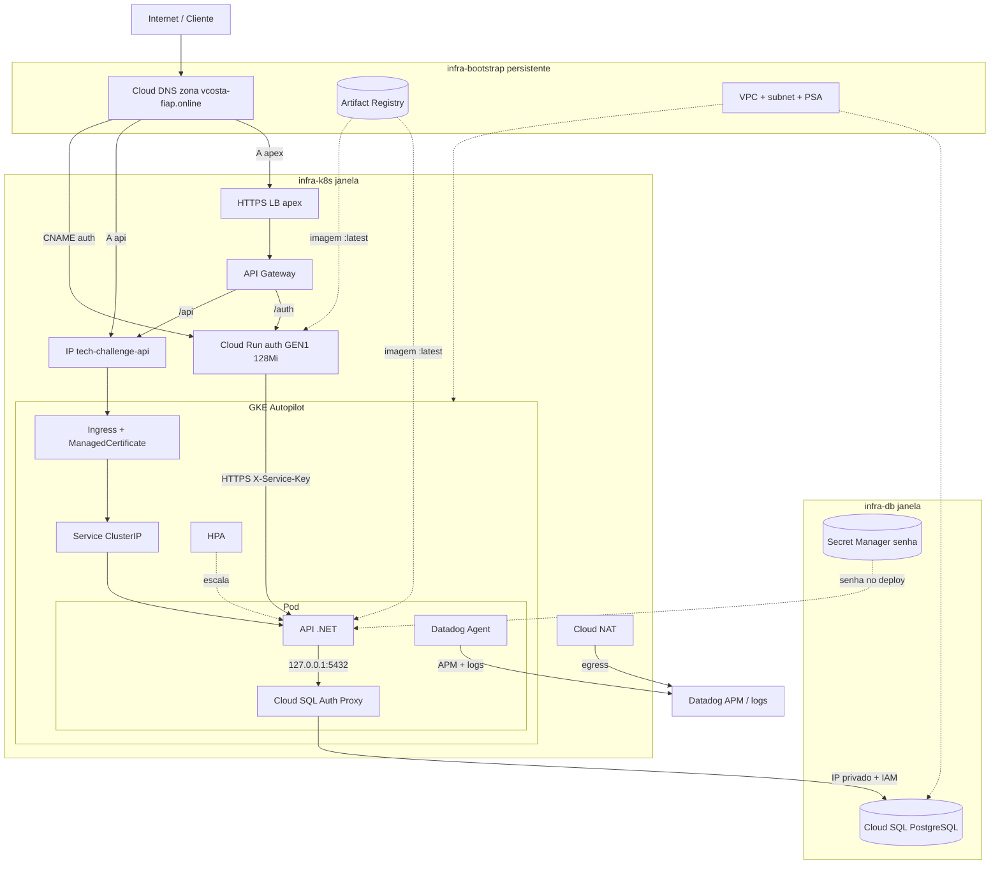

# infra-k8s

Terraform do **GKE Autopilot** que hospeda a API na GCP — Tech Challenge FIAP ([fiap-vcosta](https://github.com/fiap-vcosta)).

## Escopo

- Cluster GKE Autopilot regional `tech-challenge-gke` em `us-central1`, VPC-native na rede do `infra-bootstrap`
- Control plane só por **DNS endpoint** (autenticação IAM), sem endpoint IP
- **Cloud NAT** na subnet da demo (egress HTTPS dos nós privados — Datadog Agent/sink; sobe e desce com este stack)
- Binding de Workload Identity da service account Kubernetes da API sobre a service account de runtime
- Cloud Run **`auth`** (imagem do repo [`auth`](https://github.com/fiap-vcosta/auth)) — sobe e desce com este stack
- IPs globais + records Cloud DNS `api.<domínio>` (A), `auth.<domínio>` (CNAME) e apex (A) + domain mapping do Cloud Run auth
- **API Gateway** + HTTPS LB no apex (`https://<domínio>/auth` e `/api`) com backends HTTPS nomeados
- State remoto em GCS (o bucket é do `infra-bootstrap` e não morre no destroy)

Este stack entrega **cluster, identidade, auth, DNS da janela e API Gateway**. Os manifests da API (Deployment, Service, Ingress, HPA, ConfigMap, namespace e service account) vivem no repo [`api`](https://github.com/fiap-vcosta/api). A rede e a **managed zone** vêm do [`infra-bootstrap`](https://github.com/fiap-vcosta/infra-bootstrap) via `terraform_remote_state`; o banco é do [`infra-db`](https://github.com/fiap-vcosta/infra-db). Kind / self-hosted não são caminho de entrega.

Root module: [`terraform/`](terraform/).

## Componentes (nuvem)



Entrada oficial: `https://vcosta-fiap.online/auth` e `https://vcosta-fiap.online/api/...`. Sequência documento → JWT → aprovar: README do [`auth`](https://github.com/fiap-vcosta/auth). Modelo de dados: [`api/docs/08_modelo-de-dados.md`](https://github.com/fiap-vcosta/api/blob/main/docs/08_modelo-de-dados.md).

## Contrato com o repo `api`

O binding em [`terraform/workload-identity.tf`](terraform/workload-identity.tf) autoriza uma service account Kubernetes específica a assumir a service account GCP de runtime:

| Valor | Onde vive aqui | Onde vive na `api` |
|-------|----------------|--------------------|
| Namespace `tech-challenge` | `var.k8s_namespace` | `metadata.namespace` dos manifests |
| Service account `api` | `var.k8s_service_account` | `ServiceAccount` + `serviceAccountName` do pod |
| E-mail da SA de runtime | remote state do bootstrap | anotação `iam.gke.io/gcp-service-account` |

Renomear namespace ou service account de um lado sem o outro **não** quebra `plan` nem `apply`: o binding continua válido apontando para uma identidade que não existe, e o sintoma aparece só em runtime, com o Cloud SQL Auth Proxy falhando na autenticação.

O binding mora aqui, e não no `infra-bootstrap`, porque o pool `PROJECT.svc.id.goog` só existe enquanto há cluster com Workload Identity no projeto: ele nasce e morre com a demo.

## Entrada HTTP

O desenho oficial é **HTTPS no apex** + **API Gateway** (`/auth` + `/api`) — ver [ADR 002](docs/adrs/002-api-gateway.md).

O produto API Gateway só expõe `*.gateway.dev` nativamente. Para `https://vcosta-fiap.online/auth` e `/api`, este stack coloca um **HTTPS LB global** (Serverless NEG → Gateway) na frente, com cert gerenciado no apex.

Neste stack, a cada `tf-apply`:

| Peça | Valor típico |
|------|----------------|
| IP `tech-challenge-api` | Ingress da API (`api.<domínio>`) — **backend** |
| IP `tech-challenge-entry` | HTTPS LB da **entrada** (apex → Gateway) — output `gateway_entry_ip` |
| `api.<domínio>` | A → IP da API (backend do Gateway) |
| `auth.<domínio>` | CNAME → `ghs.googlehosted.com` + domain mapping |
| Apex `<domínio>` | A → `gateway_entry_ip` (Cloud DNS, este stack) |
| Entrada oficial | `https://<domínio>/auth` e `https://<domínio>/api/...` |

Backends do Gateway: `https://auth.<domínio>` e `https://api.<domínio>`.

O Ingress + ManagedCertificate de `api.…` ficam no repo `api`. A managed zone é do `infra-bootstrap`; os nameservers do domínio já apontam para o Google (`ns-cloud-c*`), então os records deste stack respondem na internet a cada `tf-apply`.

Pré-requisito do Gateway: `https://api.…` com cert Active e auth HTTPS. Ordem: `tf-apply` (cluster + auth + records Cloud DNS `api`/`auth`/apex + Gateway/LB) → `deploy` API → esperar ManagedCertificate Active em `api.…` e o cert do apex Active.

**Custo:** na janela há **dois** IPs/LBs globais (API + entrada). Ambos saem no `tf-destroy`. Os records da janela (incluindo o apex) sobem e descem com este stack; no destroy o apex deixa de resolver até o próximo apply.

## Acesso ao cluster

O control plane não tem endpoint IP; o acesso é pelo DNS endpoint, autenticado por IAM:

```bash
gcloud container clusters get-credentials tech-challenge-gke \
  --region us-central1 --dns-endpoint
```

## CI vs CD

| Tipo | Quando | Automático? |
|------|--------|-------------|
| **CI** `fmt` + `validate` | PR / push | Sim ([`.github/workflows/ci.yml`](.github/workflows/ci.yml)) |
| **CI** `plan` (OIDC) | PR | Sim |
| **`tf-apply` / `tf-destroy`** | Janela da demo | Só manual (`workflow_dispatch`) |

Merge em `main` **nunca** liga o cluster.

O `tf-destroy` apaga todo `Service type: LoadBalancer` e todo `Ingress` do cluster antes do `terraform destroy`: destruir o cluster com um deles de pé pode deixar forwarding rule / IP global órfão, cobrado por hora mesmo sem tráfego. A varredura é por tipo, não por nome, justamente porque os manifests não são deste repo.

Org vars consumidas: `GCP_PROJECT_ID`, `GCP_REGION`, `GCP_AR_REPOSITORY`, `GCP_WORKLOAD_IDENTITY_PROVIDER`, `GCP_SERVICE_ACCOUNT_EMAIL`, `GCP_GKE_CLUSTER_NAME`, `DOMAIN` (ex. `vcosta-fiap.online`). O Cloud Run auth recebe `API_BASE_URL=https://api.<DOMAIN>`. Secrets `JWT_CLIENTE_KEY` / `SERVICE_AUTH_KEY` (iguais aos da `api` / org). Os workflows falham cedo se o obrigatório vier vazio.

## Auth (Cloud Run)

Pré-requisito: pelo menos um **`build-push`** no repo `auth` (imagem `…/auth:latest` no Artifact Registry).

No `tf-apply`, `API_BASE_URL` do auth sai de `DOMAIN` (`https://api.<DOMAIN>`). A imagem usada é sempre `…/auth:latest`. Outputs: `auth_service_uri`, `auth_image`, `auth_hostname`. Custo mínimo: GEN1 + 128Mi + `cpu_idle` — [ADR 003](docs/adrs/003-cloud-run-auth-gen1.md).

O `tf-destroy` deste repo remove Cloud Run auth, domain mapping, records DNS, IPs globais, API Gateway e o HTTPS LB de entrada **junto** com o cluster.

## Comandos

```bash
cd terraform
terraform fmt -check
terraform init -backend=false
terraform validate
```

## Ordem na demo

1. `infra-bootstrap` aplicado (zona Cloud DNS + NS Google no domínio, uma vez)
2. Repo `auth` → merge/`build-push` (imagem no AR; pode ser antes da janela)
3. `infra-db` → `tf-apply`
4. Este repo → `tf-apply` (Autopilot + Cloud Run auth + records Cloud DNS `api`/`auth`/apex + Gateway/LB)
5. `api` → Ingress/cert + `deploy`; esperar ManagedCertificate **Active** em `api.…`
6. Esperar cert do apex Active → smoke `https://vcosta-fiap.online/auth` e `/api/...`
7. Destroy inverso: este repo → `infra-db`

O `infra-bootstrap` (incluindo a zona DNS) é pré-requisito aplicado uma vez e não entra nesse ciclo.

## Decisões (ADRs)

Ver [`docs/README.md`](docs/README.md): Autopilot/`tf-destroy`, API Gateway e Cloud Run `auth` (GEN1 / 128Mi / `cpu_idle`).

## Repos da org

| Repo | Papel | Diagrama / doc-chave |
|------|--------|----------------------|
| [`infra-bootstrap`](https://github.com/fiap-vcosta/infra-bootstrap) | Rede, WIF, AR, zona DNS | Persistente |
| [`infra-db`](https://github.com/fiap-vcosta/infra-db) | Cloud SQL | — |
| [`infra-k8s`](https://github.com/fiap-vcosta/infra-k8s) | GKE + Gateway + Cloud Run auth | **Componentes (acima)** |
| [`api`](https://github.com/fiap-vcosta/api) | App + manifests + Requestly | [ER / modelo de dados](https://github.com/fiap-vcosta/api/blob/main/docs/08_modelo-de-dados.md) |
| [`auth`](https://github.com/fiap-vcosta/auth) | Imagem documento → JWT | Sequência no README |

## Agentes

Ver [AGENTS.md](AGENTS.md).
